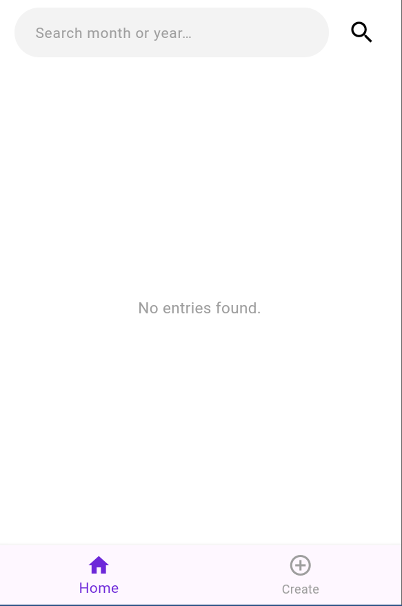
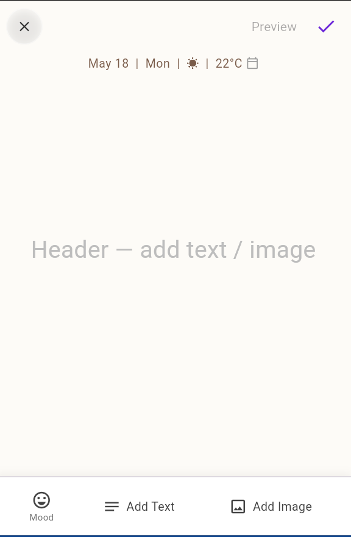
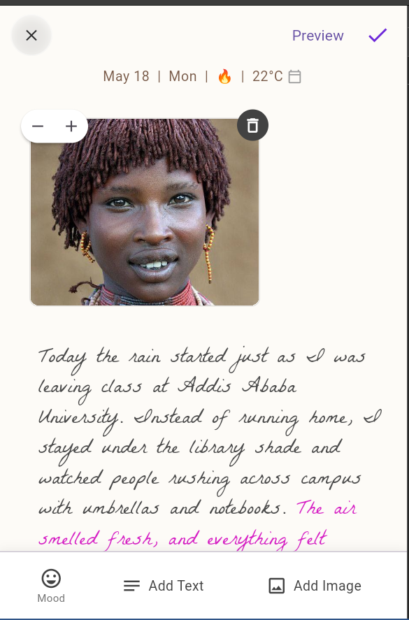
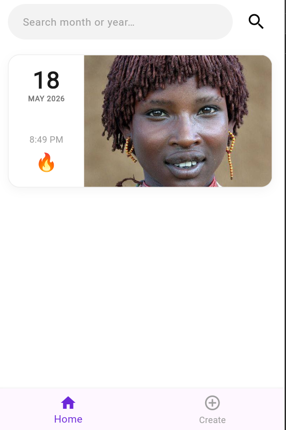
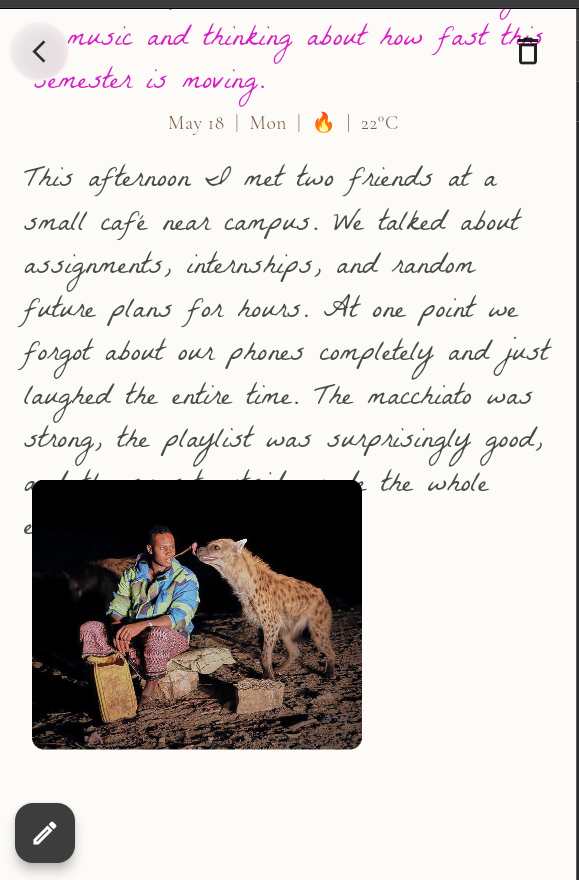

# Canvas Diary Application (Provider + HTTP Edition)

## 👤 Student Information

| Field            | Details      |
| :--------------- | :----------- |
| **Student Name** | Beiment Abdi |
| **Student ID**   | UGR/8524/16  |
| **Section**      | Section 1    |

---

A modern, fluid Flutter diary application built to satisfy core software engineering academic requirements for advanced state management, asynchronous networking, and responsive canvas interaction.

---

## 🚀 Core Features

- **Clean CRUD Architecture:** Complete integration with a public mockup REST API layer (`JSONPlaceholder`) to handle creating, reading, updating, and deleting diary card logs asynchronously.
- **State-Driven Interactive Canvas:** Dynamic content positioning engine featuring a streamlined, zero-lag single-finger image dragging viewport workspace.
- **Tactile Zoom & Element Controls:** Corner-anchored UI action shortcuts including quick-step buttons (`+` / `-`) for instant, scale-multiplier adjustments and an immediate element removal trash module.
- **Zero-Authentication Safe Pipeline:** Direct application boot targeting the main dashboard view, eliminating redundant profile/login onboarding flows while safely keeping global database providers active.
- **Robust Network UX States:** Graceful interface transitions handling loading spinners and a dedicated fallback "No entries found" view for empty state returns rather than crashing.

---

## 🛠️ Tech Stack & Dependencies

- **Framework:** Flutter (Android Native Device Testing on Infinix X688B)
- **State Management:** `Provider` (Latest ChangeNotifier Architecture)
- **Network Client:** `http` package
- **Design & Fonts:** Custom card border properties, elevation layers, and custom typography assets.

---

##screenshots

### 📱 Application Screenshots







## 📂 Project Structure

```text
lib/
│
├── models/         # Diary entry schemas and visual spatial data states
├── providers/      # ChangeNotifier managers handling layout and network state
├── screens/        # Home dashboards and draggable creation canvas views
├── services/       # Unauthenticated REST API service wrappers for JSONPlaceholder
├── widgets/        # Isolated control interfaces and styled layouts
└── main.dart       # Direct dashboard execution router shell
```
